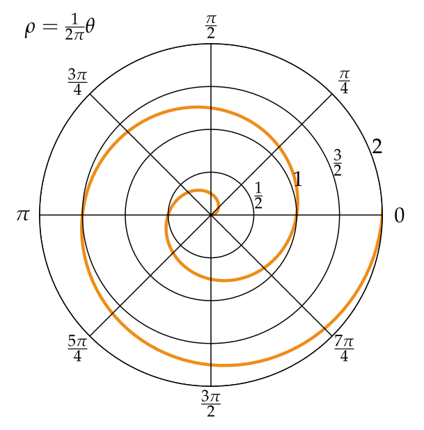

# Archimedes  
_A matrix-inspired spiral with vanilla javascript, html, and css_  
[Demo](https://matrix-spiral.herokuapp.com)  

---  

### A long story  
I set up the first iteration of this in 2009 when I was still in university. I had a talk with a classmate about my plan to build a visualization of the iconic _Matrix_ "falling green letters" screen using the HTML5 Canvas. The next day when I showed up to class I was frustrated to see he had already built it. Instead of being upset that he stole my idea, I focused on taking the idea a step further.

It was originally very wonky, using setTimeout and setInterval to run the animation loop. It wasn't until 2018 that I rediscovered it, and recently decided to re-write it using RequestAnimationFrame and CSS Transitions.  

### The Archimedean spiral
When I first looked up the algorithm for the spiral I was apprehensive. Translating the idea and plotting the DOM elements using Javascript was even more of a challenge.  

In my experience writing shaders or working with WebGL I learned that experimentation can help guide you in the right direction- and sometimes even lead to unexpectedly interesting results.

